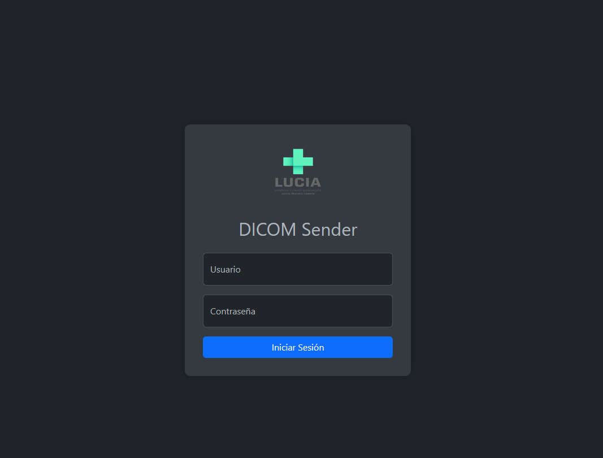
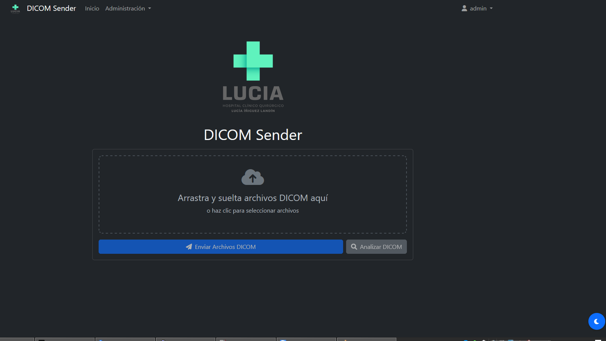
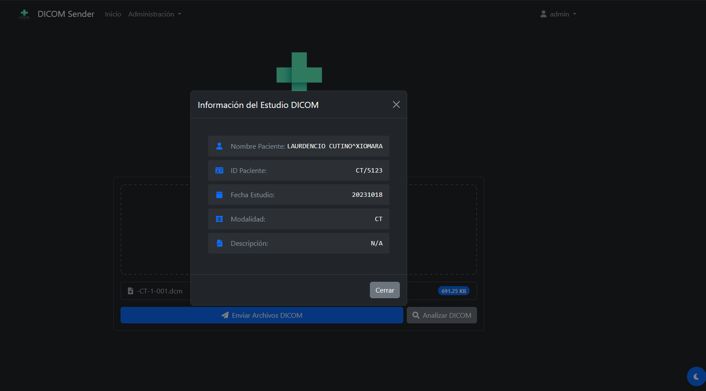

# DCMSEND Web Interface

Una interfaz web para enviar archivos DICOM utilizando las herramientas DCMTK. Este proyecto proporciona una interfaz web amigable para las utilidades dcmsend y dcmdump de DCMTK.

## 🚀 Características

- Interfaz web intuitiva para enviar archivos DICOM
- Análisis de metadatos DICOM usando dcmdump
- Sistema de autenticación de usuarios
- Registro de actividades
- Contenedor Docker para fácil implementación
- Interfaz responsive y moderna

## 📋 Prerrequisitos

- Docker
- Docker Compose

## 🔧 Instalación

1. Clonar el repositorio:
```bash
git clone https://github.com/cubanitoalex/DICOM_Sender_WEB.git
cd DICOM_Sender_WEB
```

2. Construir y ejecutar con Docker Compose:
```bash
docker compose build
docker compose up -d
```

La aplicación estará disponible en `http://localhost:5050`

## 🛠️ Construido con

- [Flask](https://flask.palletsprojects.com/) - Framework web
- [SQLAlchemy](https://www.sqlalchemy.org/) - ORM para la base de datos
- [DCMTK](https://github.com/DCMTK/dcmtk) - Conjunto de herramientas DICOM
- [Docker](https://www.docker.com/) - Contenedorización

## 📦 Estructura del Proyecto

```
dcmsend/
├── app.py              # Aplicación principal Flask
├── models.py           # Modelos de la base de datos
├── forms.py            # Formularios web
├── templates/          # Plantillas HTML
├── static/            # Archivos estáticos (CSS, JS, imágenes)
├── instance/          # Base de datos SQLite
├── Dockerfile         # Configuración de Docker
└── docker-compose.yml # Configuración de Docker Compose
```

## 🔍 Uso de DCMTK

Este proyecto utiliza DCMTK (DICOM ToolKit), una colección de bibliotecas y aplicaciones para trabajar con DICOM. Las principales herramientas que utilizamos son:

- **dcmsend**: Para enviar archivos DICOM
- **dcmdump**: Para analizar y mostrar el contenido de archivos DICOM

Para más información sobre DCMTK, visita el [repositorio oficial de DCMTK](https://github.com/DCMTK/dcmtk).

## 📄 Licencia

Este proyecto está bajo la Licencia MIT - ver el archivo [LICENSE.md](LICENSE.md) para más detalles.

## 🎯 Funcionalidades Principales

1. **Gestión de Usuarios**
   - Sistema de login/logout
   - Roles de usuario (admin/usuario normal)
   - Gestión de permisos

2. **Manejo de Archivos DICOM**
   - Carga de archivos DICOM
   - Análisis de metadatos
   - Envío a destinos DICOM

3. **Registro de Actividades**
   - Seguimiento de acciones de usuario
   - Registro de envíos DICOM
   - Registro de errores

## 🔐 Configuración de Seguridad

Por defecto, la aplicación utiliza una configuración segura:
- Autenticación requerida para todas las operaciones
- Sesiones seguras
- Contraseñas hasheadas
- Control de acceso basado en roles

## 🤝 Contribuir

Las contribuciones son bienvenidas. Por favor, lee [CONTRIBUTING.md](CONTRIBUTING.md) para detalles sobre nuestro código de conducta y el proceso para enviarnos pull requests.

## 📸 Capturas de Pantalla

### Pantalla de Login


### Panel Principal


### Envío de Archivos DICOM


## ⚠️ Notas Importantes

- Esta aplicación está diseñada para uso en desarrollo/pruebas
- Para producción, considere medidas de seguridad adicionales
- Asegúrese de configurar correctamente los permisos DICOM

## 📞 Soporte

Si encuentras un bug o tienes una sugerencia, por favor abre un issue en el repositorio de GitHub.
